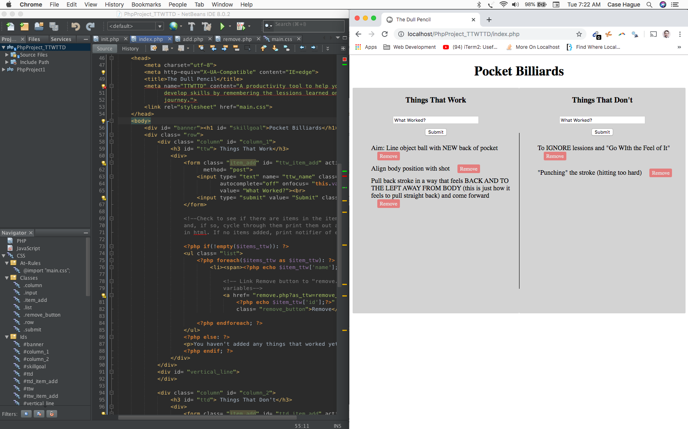

# ttwttd

I developed this project with Php, MySQL and Netbeans IDE. I downloaded MAMP to run the Apache server on my machine so I could develop locally.

I am currently working on a web-based version of this web-application but, in the meantime, please view the below snaphsot of the web-app as developed on Netbeans.

